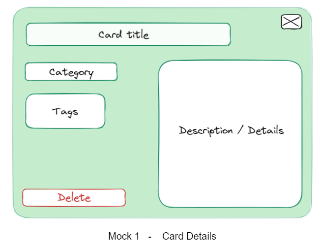
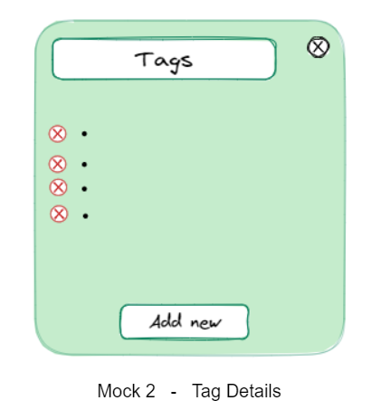
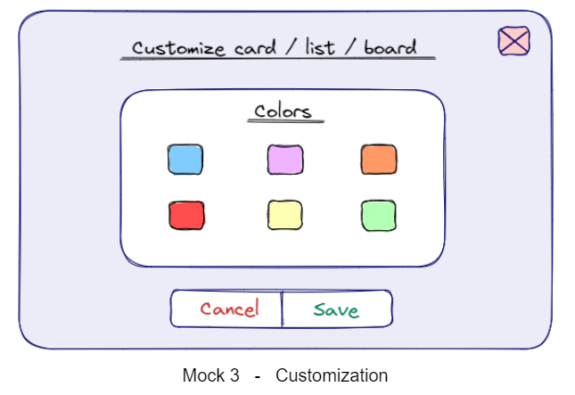
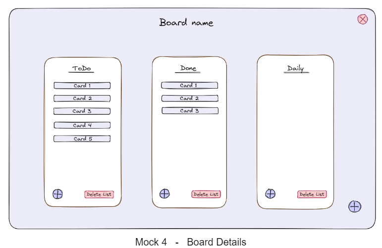

# Talio

### Stakeholders
* User - Any person that is able to view, edit and remove the boards, lists and cards from the system
* Admin - Any person that is able to start or stop the server and take control of certain unexpected situations such as lagging and bugs

### Terminology
* Cards - Single-purpose tasks, which have a title
* Lists - Are used to group together cards into specific categories. Some examples of these could be TODO, Doing, Done
* Board - A collection of lists & cards that is characterized by a specific id/name
* Overview - The main menu of the application containing the boards users can access

### Mocks
All mockups are attached to the end of this document to illustrate our design ideas and will be referenced where relevant. Note that the background colors of the boards and pop ups are chosen to better illustrate the design and will not necessarily be implemented in this way.

## MUST Requirements 

As a user, I want…
* to be able to see the board without the need of registration so that I can easily access the overview of lists and cards.
* to be able to see different titled lists so that I can create categories for my thoughts.
* the lists to contain titled cards so that I can visualize my tasks inside categories.
* to be able to drag a card from its current list and drop it into another list so that I can constantly categorize the tasks.
* the cards to click into place one below the other when I drag them into a list so that they stay organized, instead of overlapping or being unaligned.
* to be able to add new lists so that I can better categorize the cards.
    * there to be a button to create a new list on the board
    * there to be a way to name this list when creating it
    * this list to appear on the board
    * this change to have a permanent effect
* to be able to remove existing lists when they are no longer required so that new ones can be added in their place allowing a restructuring of the board.
    * each list to have a ‘delete’ button
    * this button to remove the list from the board when clicked
    * this change to have a permanent effect
* to be able to create new cards because I want to add new tasks.
    * there to be a button to create a new card in a list
    * there to be a way to name this card when creating it
    * this card to appear in the selected list
    * this change to have a permanent effect
* to be able to remove existing cards when they are no longer needed to better maintain the tasks that currently matter for me.
    * each card to have a ‘delete’ button
    * this button to remove the card from the list and board when clicked
    * this change to have a permanent effect
* to be able to join the general user board and have the same level of access as other users, allowing me to collaborate and use all the features available on the board.
* to be able to save and see changes on the board without refreshing the page.

As an admin, I want…
* to be able to edit lists/cards so that I work together with the other users.
* to be able to start an instance of the application (the server) and share the connection with other users so that they can work on it as a group.
* to be able to restart the server without the board losing any information so that no work is lost.

## SHOULD Requirements

As a user, I want…
* to be able to see the current board’s id/name so that I can know which board I am currently looking at.
    * the id/name should be displayed at the top of the board
* to be able to see an overview containing all of the boards so that I can easily navigate through them.
    * to make a board my current board by clicking on it
    * there to be an exit button when I am on a board
    * to be sent back to the overview when clicking the exit button
* to be able to create a new board so that different tasks are organized by topic
    * there to be a ‘new’ button in the overview allowing me to create a new board with a custom id/name
* to be able to search for a board by its id/name in the overview so that I can easily find a specific board.
    * there to be a text box where I can type the id/name
    * there to be a ‘join’ button next to the text box
    * to go to the board specified by the id/name I typed when I click this button
    * there to be a message in case no board with that id/name exists
* to be able to click on a card to open a message box so that I can see extra information about the card (refer to mock up 1).
* to be able to see the tags of the existing cards so that I can know the main purpose of them, such as whether an activity is urgent.
    * the card details to have a section which contains these tags (refer to mock up 1)
* to be able to add tags to existing cards so that I can better categorize the tasks.
    * the tag section of the card details to contain an ‘insert’ button (refer to mock up 2)
    * there to be a way for me to name the tag when I click the button (refer to mock up 2)
    * the tag to be added to the card
    * this change to have a permanent effect
* to be able to remove tags from existing cards so that I can get rid of it in case I consider it as no longer necessary.
    * the tag to contain a ‘delete’ button (refer to mock up 2)
    * the tag to be removed from the card’s description when I click the button
    * this change to have a permanent effect
* to have a pop up container appear on the top right of the screen when I right-click on a certain element (card/list/board) containing settings for customization.
    * to have six colored buttons to choose between (refer to mock up 3)
* to be able to change the color of cards so that similar tasks can be organized by color.
* to be able to change the color of lists so that they are more easily distinguishable.
* to be able to change the color of the board so that it has more personality to it.
* to be able to change the color of tags, which applies to all tags with the same name, so that a more suitable color can be chosen for a given tag.

As an admin, I want…
* to be able to delete boards so that changes can be made to the organization of topics, like removing tasks we are finished with.
* to be able to rename boards so that the names more accurately corresponds to the topic.

## COULD Requirements 

As a user, I want…
* to be able to use various keyboard shortcuts so that I can navigate through the application easily without using the mouse.
    * there to be a key mapped for creating a new list
    * there to be a key mapped for navigating through the lists
    * there to be a key mapped for creating a new card inside a selected list
    * there to be a key mapped for navigating through the cards inside a list
    * there to be a key mapped for exiting the current board
* to have the option to make a board password protected so that only users with the password can edit it. 
* there to be a pop up field for a password where I can type it if I want to edit the board
* there to be an error message in case I introduce the wrong password
* there to be an option if I do not have the password so that I can view the board, but in read only mode
* there to be a pop up confirmation box when I try to delete a list to confirm the action
* to be able to filter cards in a board by tag 
    * there to be a text field where I could specify the tag name
    * there to be a button named ‘filter’
    * only the cards having the specified tag to be displayed
    * a button to appear next to the ‘filter’ button which removes the filter action
* to be able to change the color of elements using RGB sliders
    * there to be an option below the six set colors in the top-right pop up panel that allows me to freely set the color using three sliders adjusting RGB values

As an admin, I want…
* to be able to modify and update the password of a board

## Mock Ups

