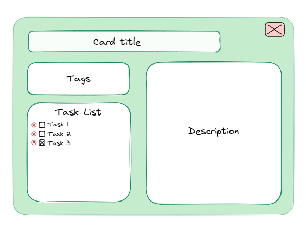
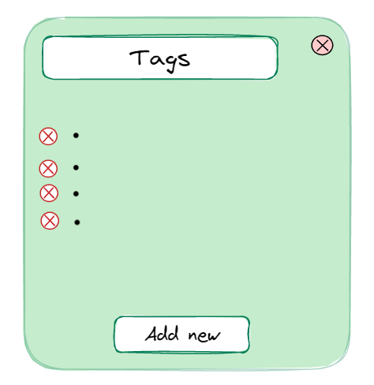
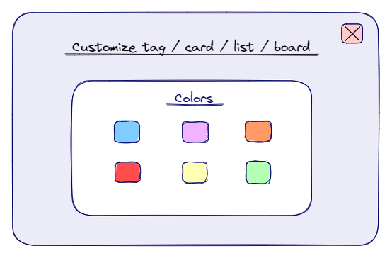
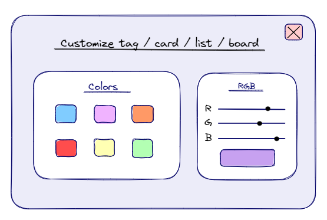
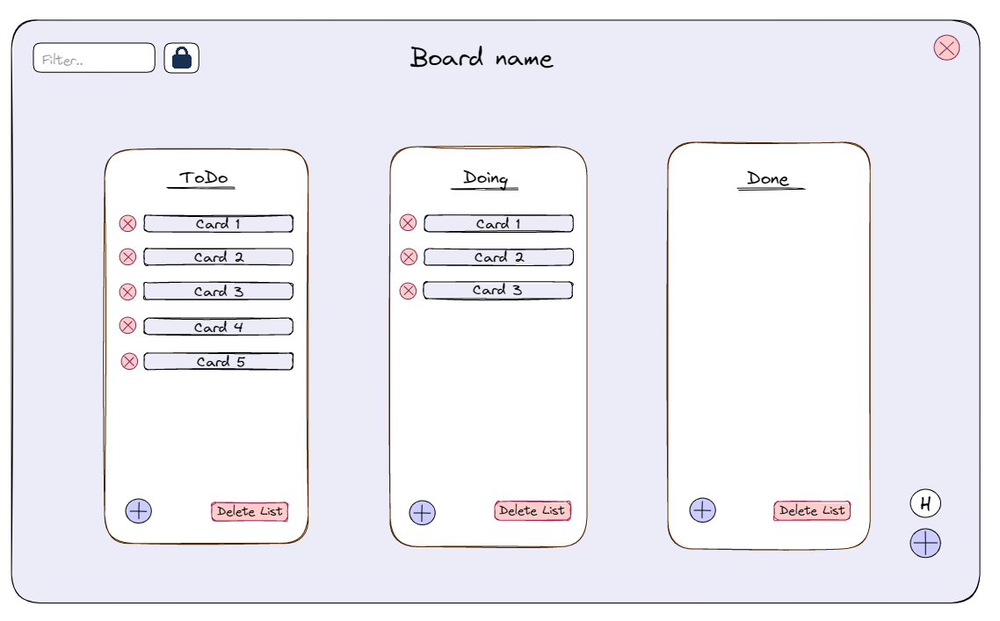

# Talio

## Stakeholders
* User - Any person that is able to view, edit and remove the boards, lists and cards from the system.
* Admin - Any person that is able to start or stop the server and take control of certain unexpected situations such as lagging and bugs. Moreover, they are able to rename and delete boards.

## Terminology
* Cards - Single-purpose tasks, which have a title
* Lists - Are used to group together cards into specific categories. Some examples of these could be *TODO*, *Doing*, *Done*
* Board - A collection of lists & cards that is characterized by a specific id/name
* Overview - The main menu of the application containing the boards users can access
* Scene - Application content that is displayed inside a separate window

## Mocks
All mockups are attached to the end of this document to illustrate our design ideas and will be referenced where relevant. Note that the background colors of the boards and scenes are chosen to better illustrate the design and will not necessarily be implemented in this way.

## Minimal Application
*These features allow an instance of the application to be started and the client to be able to view an existing board when opening the application. They have the ability to see the simple board layout (see mock 4) with lists and cards, the latter of which can be moved between lists using drag and drop. Additionally, these features allow editing of the elements in the minimal application (insertion, deletion, updates) with a permanent effect on the database, even if the server is restarted.*

As a user, I want…
* to be able to see the board without the need of registration so that I can easily access the overview of lists and cards.
* to be able to see different titled lists so that I can order my thoughts.
* the lists to contain titled cards so that I can visualize my tasks inside categories.
* to be able to drag a card from its current list and drop it into another list so that I can constantly categorize the tasks.
* the cards to click into place one below the other when I drag them into a list so that they stay organized, instead of overlapping or being unaligned.
* to be able to add new lists so that I can better categorize the cards.
    * there to be a button to create a new list on the board
    * there to be a way to name this list when creating it
    * this list to appear on the board
    * this change to have a permanent effect
* to be able to create new cards because I want to add new tasks.
    * there to be a button to create a new card in a list
    * there to be a way to name this card when creating it
    * this card to appear in the selected list
    * this change to have a permanent effect
* to be able to remove existing cards when they are no longer needed to better maintain the tasks that currently matter for me.
    * each card to have a **delete** button
    * this button to remove the card from the list and board when clicked
    * this change to have a permanent effect
* to be able to remove existing lists when they are no longer required so that new ones can be added in their place allowing a restructuring of the board.
    * each list to have a **delete** button
    * this button to remove the list from the board when clicked
    * this change to have a permanent effect
* to be able to join the board and have the same level of access as other users, allowing me to collaborate and use all the features available on the board.
* to be able to see changes on the board when refreshing the page so    that I can synchronize my work with other users.
    * there to be a **refresh** button 
    * this button to load any new changes made by others

As an admin, I want…
* to be able to start an instance of the application (the server) and share the connection with other users so that they can work on it as a group.
* to be able to restart the server without losing any information so that all the completed work can be restored.

## Multi Boards
*These features allow the creation and use of multiple distinct boards between different clients, which can be deleted and/or renamed by an admin.* 

As a user, I want…
* to be able to see the current board’s id/name so that I can know which board I am looking at.
    * the id/name to be displayed at the top of the board
* to be able to see an overview containing all of the boards so that I can easily navigate through them.
    * to go to a board when I click on it
    * there to be an **exit** button when I am on a board
    * to be sent back to the overview when clicking the exit button
* to be able to create a new board so that different tasks are organized by topic.
    * there to be a **new** button in the overview 
    * this button to allow me to create a new board with a custom id/name
* to be able to search for a board by its id/name in the overview so that I can easily find a specific board.
    * there to be a text box where I can type the id/name
    * there to be a **join** button next to the text box
    * to go to the board specified by the id/name I typed when I click this button
    * there to be a message in case no board with that id/name exists

As an admin, I want…
* to be able to authenticate myself as an admin so that I can access more features.
    * there to be a scene when I start the application.
    * this scene to allow me to input a password giving me the admin status 
    * this scene to let me continue as a normal user if I don’t have the password
* to be able to delete boards so that changes can be made to the organization of topics.
* to be able to rename boards so that the names more accurately correspond to the topic.

## Card Details
*These features allow more information to be added to cards, such as tags and tasks. These can be added in a separate scene displaying all the card information.* 

As a user, I want…
* to be able to click on a card to open a new scene so that I can see extra information about the card (refer to mock up 1).
    * there to be a textbox for the description of the card
    * to be able to edit the description directly in the textbox
* to be able to see tasks associated with a card when I click on it (see mock up 1) so that I can divide the work into manageable portions.
    * these tasks to be displayed one under the other as a checklist
    * to be a button to mark a task as done
    * to be able to edit the tasks directly in the checklist
    * there to be a button to delete a task
* to be able to see the tags of the existing cards so that I can know the main purpose of them, such as whether an activity is urgent.
    * the card details to have a section which contains these tags (refer to mock up 1)
* to be able to add tags to existing cards so that I can better categorize the tasks.
    * the tag section of the card details to contain an **add new** button (refer to mock up 2)
    * there to be a way for me to name the tag when I click the button (refer to mock up 2)
    * the tag to be added to the card
    * this change to have a permanent effect
* to be able to remove tags from existing cards so that I can get rid of it in case I consider it as no longer necessary.
    * the tag to contain a **delete** button (refer to mock up 2)
    * the tag to be removed from the card’s description when I click the button
    * this change to have a permanent effect

## Customization
*These features allow overall customization of the board, creating more opportunities for the client to express themselves.* 

As a user, I want…
* to have a new scene appear when I right-click on a certain element containing settings for customization (refer to mock up 3.1).
* to be able to change the color of cards so that similar tasks can be organized by color.
* to be able to change the color of lists so that they are more easily distinguishable.
* to be able to change the color of the board so that it has more personality to it.
* to be able to change the color of tags, which applies to all tags with the same name, so that a more suitable color can be chosen for a given tag.

## Keyboard Shortcuts
*This feature simplifies the use of the application by implementing keyboard shortcuts. Additionally, it provides a help feature to showcase these shortcuts.* 

As a user, I want…
* to be able to use various keyboard shortcuts so that I can navigate through the application easily without using the mouse.
    * there to be a key mapped for creating a new list
    * there to be keys mapped for navigating through the lists
    * there to be a key mapped for creating a new card inside a selected list
    * there to be keys mapped for navigating through the cards inside a list
    * there to be a key mapped for viewing the card details
    * there to be a key mapped for exiting the current board
* there to be a scene which shows how the keys are currently mapped so that I can see which shortcut is linked to which action.
    * there to be a **H** button displayed on the board
    * to see the information scene when I click on this button

## Security measures
*These features allow the client to implement certain security measures concerning the access to their boards by other users.*

As a user, I want…
* to have the option to make a board password protected so that only users with the password can edit it. 
    * there to be a lock button that makes the board password protected
    * to be able to set the password when I click this button
* to be able to join a password protected board by inputting the password so that I can edit the board. 
    * there to be a field for a password when I join the board
    * there to be an error message in case I use the wrong password
* to be able to join the board in read only mode in case I don’t have the password.

As an admin, I want…
* to be able to modify and update the password of a board.

## Advanced Interface
*These features allow further customization of the board. Additionally, they let the user see changes made by others without needing to refresh, and allow them to filter cards by their tags.* 

As a user, I want…
* to be able to filter cards inside a board by tag.
    * there to be a text field where I could specify the tag name
    * there to be a button named **filter**
    * only the cards having the specified tag to be displayed
    * a button to appear instead of the **filter** button which removes the filter action
* to be able to save and see changes on the board without refreshing the page.
* to be able to change the color of elements using RGB sliders.
    * there to be three sliders to the right of the six set colors (refer to mock up 3.2) 
    * these sliders to allow me to freely set the color using RGB values

## Mock Ups
### Mock 1

### Mock 2

### Mock 3.1

### Mock 3.2

### Mock 4

